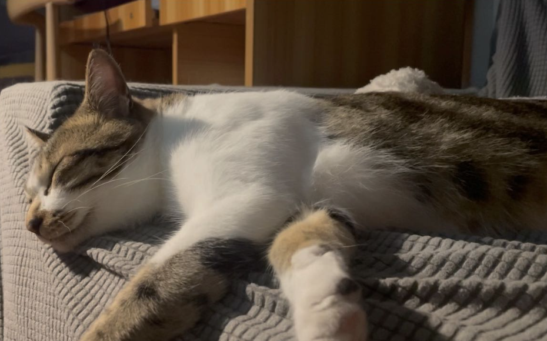

# Tu-tu Turing
Turing (cat version) is a black and white cat, specilizes at all the kinds of ball games. His research interests are anthropology and sociology, the main research activity is observing human-beings from a high place.  

:e-mail: tu-tu [at] cat-lives-matter [dot] com

### News
> :birthday: 20, July, 2022: happy 1-year birthday, tu-tu!
> 
> :house_with_garden: Sept, 2021: welcome home!

### Turing at field work
 
 

* * *

# Pi-pi Pythagoras
Pythagoras (cat version) is a Chinese Li Hua cat, specilizes at recreating beautiful textures on fabric furnitures. His research interest is animal relations, i.e., how to protect one's own food from Turing. Also, he is obsessed with [_BBC Blue Planet_](https://www.bbcearth.com/shows/blue-planet).

:e-mail: pi-pi [at] cat-lives-matter [dot] com

### News
> :birthday: 20, June, 2022: happy 1-year birthday, pi-pi!
> 
> :house_with_garden: Oct, 2021: welcome home!

### Pythagoras in contemplation

 

